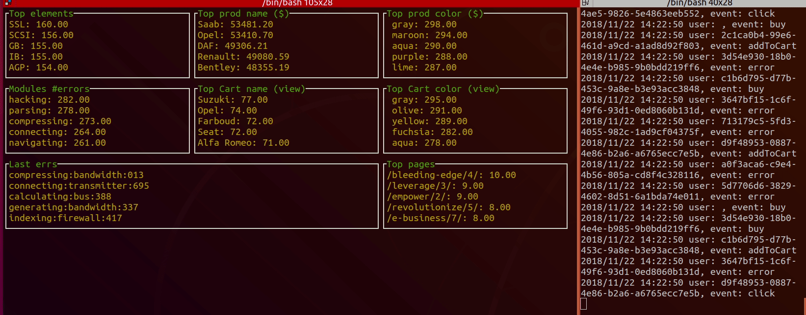

# Kafka Go playground

While learning Kafka I made this project to showcase the Go libraries. It uses the Sarama Go package and Confluent docker images. 

## Requirements

* Git, Bash
* Docker 15+ and Docker-compose
* Go 1.11+
* 8Gb RAM+ (for kafka)
* ~3GB free HDD space (for the images)
* (free) ports: 2181, 9092, 8081, 8082

## Kafka
Each example contains its own docker-compose for:
* 1 kafka broker (with messages that expiry in 1h)
* 1 zookeeper node
* 1 confluent REST API
* 1 small web UI dashboard to see the topics and messages https://github.com/Landoop/kafka-topics-ui

I am using the confluentinc Docker images: https://hub.docker.com/u/confluentinc/
and Sarama for the Go drivers: https://github.com/Shopify/sarama

If you already have a Kafka cluster run the consumers/producers with your broker ip/port.

## Analytics

A simple example with random generated events, using the event-sourcing technique (keep all raw data in a Kafka topic), aggregate all data and display analytics in a real-time CLI dashboard. 



## How to use it

```bash
git clone git@github.com:bgadrian/kafka-playground.git
cd kafka-playground/example-analytics/

#download dependencies
go mod download
go mod verify

#start the kafka cluster
./kafka-onenode-streams/run.sh

#generate users and events
./cmd/producer/run_5000msg_minute.sh 

#view the results
./cmd/consumer/run.sh

```
#### How it works

We run 1 Kafka producer that aggregates data from a series of "fake users".

#### Dispatcher
Similar with a thread pool/worker, a **dispatcher** handles the "online users", each of them being a goroutine, spawning and killing them on a random basis.
To simulate a real-world online users count fluctuation it uses a TrafficPattern (with peaks at evenings and low at nights). 

#### User
Each user produces a random batch of fake events per minute (approx), at random intervals. Each user has its own goroutine and uses a **EventGenerator**. 

By default 40% of the users are recurring (same userID) and 10% anonymous (no userID).

Users have properties that are attached to its events:
* userId(string UUID, empty for anonymous)
* sessionId (string UUID)
* time(int64) unix UTC timestamp
* country(string)


#### EventGenerator
Structures that generate random events based on some rules.
#### Events
The possible events are: 
* pageView: page(string)
* addToCart: name(string), price(int), amount(int)
* buy: name(string), price(int), amount(int)
* click: element(string)
* error: name(string)


#### Random
User properties and events are generated using the [FastFaker package](https://github.com/bgadrian/fastfaker/).
 

#### Aggregator

Consumers - takes all historical and real time data and displays it. 
It does not commit the topic offsets and reads from all the partitions. 
To display the data I used: https://github.com/gizak/termui

At first I wanted to use KSQL, ElasticSearch and Grafana, but I realised I will spend more time doing DevOps than developing in Go (which is the purpose of this example), so I went to a simpler path, a CLI Go dashboard.


## Simple CLI
If you are looking for a simple consumer/producer see [example-cli](./example-cli).

```bash
git clone git@github.com:bgadrian/kafka-playground.git
cd kafka-playground/example-cli/

#download dependencies
go mod download
go mod verify

#start the kafka cluster
./kafka-onenode-ui/run.sh 

#this will create a topic with 2 partitions and write 25 messages in it and close
./producer/write_25messages.sh

#this will keep 2 consumers open on the same topic 
./consumer/run.sh
```
## Thanks!
